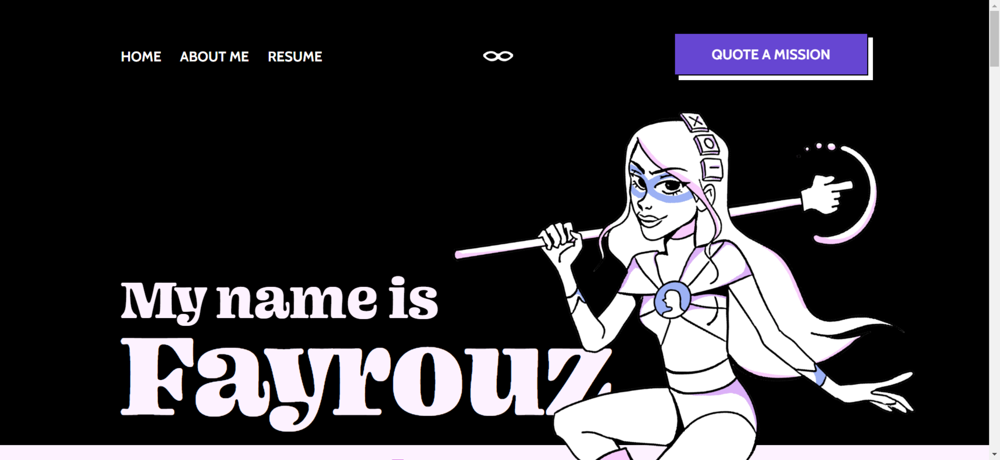
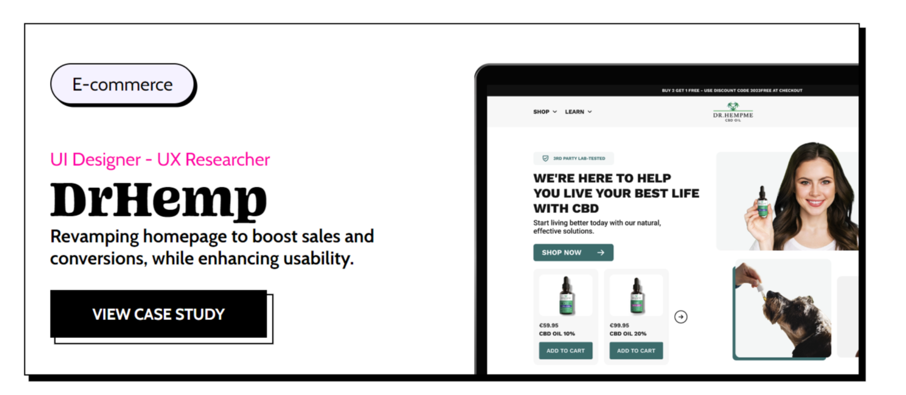
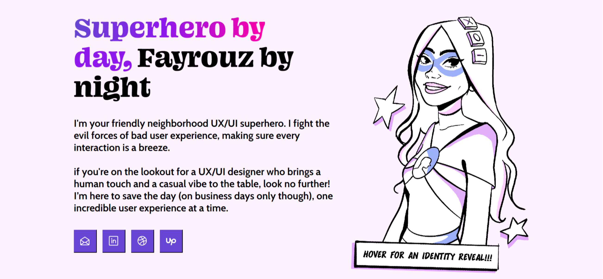

# **Fayrouz's UX/UI Portfolio - Development Repository**

Hello and welcome! This repository contains the source code for Fayrouz's personal UX/UI portfolio. As her dedicated developer, I've aimed to create a site that's a reflection of her incredible talent as a UX/UI designer.







## **Features**

- **Responsive Design**: The portfolio is optimized for both desktop and mobile viewing.
- **Animated Hero Section**: A captivating introduction to Fayrouz and her work.
- **Work Showcase**: A collection of Fayrouz's best UX/UI projects, accompanied by in-depth case studies.
- **About Section**: Dive into the journey and ethos of Fayrouz.
- **Dynamic News Ticker**: A fun superhero touch to the portfolio.
- **Contact Segment**: An invitation for visitors to connect with Fayrouz.

## **Technical Highlights**

- **Accessibility**: Built with a focus on accessibility to ensure ease of use for everyone.
- **SEO**: The site structure and meta tags have been designed to rank well on search engines.
- **Performance**: Images are optimized and employ lazy-loading for swift page loads.

## **Technologies Used**

- **HTML5**
- **CSS3**
- **JavaScript**

## **Getting Started**

1. **Clone the repository**:

   ```bash
   git clone https://github.com/MoIbrahim10/Fayrouz-portfolio
   ```

2. **Launch the site**:
   Open **`index.html`** in your favorite browser.

## **Contributing**

As this is a bespoke project tailored for Fayrouz, direct contributions are limited. However, feedback and suggestions are always appreciated. Please open an issue or contact me directly.

## **Developer Contact**

For any questions, feedback, or suggestions, please feel free to reach out:

- **[Email](mailto:dev.mo.ibrahim@gmail.com)**
- **[LinkedIn](https://www.linkedin.com/in/mohamed-ibrahim-14ba741b3)**

## **Client Details**

- Fayrouz
  - **[Email](mailto:fayrouzdakrouri@gmail.com)**
  - **[LinkedIn](https://www.linkedin.com/in/fayrouzdak/)**
  - **[Dribbble](https://dribbble.com/fayrouzdak)**
  - **[Upwork](https://www.upwork.com/freelancers/~0187d34adc84a50b3f)**

## **License**

The content and design of this portfolio are copyrighted by Fayrouz. The code is open-source under the MIT license.
